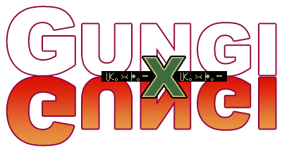

Gungi
=====

A C++ library for the Gungi board game.

Gungi is a board game from Hunter X Hunter, described as a mix between Go and
Shogi.  The goal of the game is to capture the opposing team's Commander.

## Requirements

- C++11
- [CMake](https://cmake.org/) version `3.4.1` or newer.
- [Make](https://www.gnu.org/software/make/) version `3.81` or newer.

## Building

```
$ make init
$ make
```

## Usage

```c++
#include <gungi/gungi.hpp>

using namespace gungi;

Controller controller;

int main(char *argv, int argc) {
  Controller controller;
  controller.newGame();
  return 0;
}
```

## Tests

```
$ make test
```

## Rules

Please read the documentation outlining the game rules [here](./RULES.md).

## Notation

A portable game notation is illustrated and documented [here](./NOTATION.md).

## Contributing

Please read the documentation about [contributing](./CONTRIBUTING.md).

## License

This project is licensed under the [MIT License](./LICENSE.md).

## Release History

No releases to-date.
