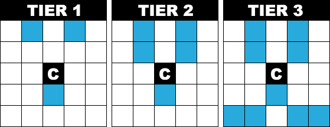

Rules of Gungi
==============

# Overview

The rules provided here have been collected from
[Hiramo's Translation](https://mmmmalo.tumblr.com/post/74510568781/rules-of-gungi)
of the Japanese rules, which was originally accumulated by a Japanese blogger,
Nishitsuji Sannkurou,
[here](http://blog.goo.ne.jp/nishitsuji-sannkurou/e/aee5280f6c4109b22f594202947bcd2c).

The game is played on a 9-by-9 (9 x 9) tile board; the same type of board as
the one used in Shoji.  The opposing forces are Black and White.  Black always
moves first, and the two sides take turns moving units.  Units that are
currently on the board are called *active*, while captured units are taken from
the board and added to the capturing player's hand; they are called *inactive*.
Horizontal rows on the board are referred to as *ranks*, while the vertical
columns are referred to as *files*.

The first three ranks of a player's side of the board are considered their
*territory*.  There is no mandated starting positions for units in Gungi;
instead the players take turns placing their units wherever they please within
their own territory during the *Initial Arrangement* phase.

The goal of the game is to capture the opposing team's Commander (similar to
the role of the King in Chess).  If a Commander is in range of a mobile or
immobile strike from an enemy unit, such that it could be captured on the next
turn, it is said to be in *check*.  A Commander cannot move into check, and
a player must make a move on their turn to get their Commander out of check;
if they cannot, then their Commander is in *checkmate*, and they lose the game.

# Table of Contents

- [Initial Arrangement](#initial-arrangement)
- [Attacks](#attacks)
  - [Mobile Strike](#mobile-strike)
  - [Immobile Strike](#immobile-strike)
  - [Capturing](#capturing)
- [Drops](#drops)
- [Effects](#effects)
  - [Active Effects](#active-effects)
    - [1-3 Tier Exchange](#1-3-tier-exchange)
    - [Substitution](#substitution)
    - [Forced Recovery](#forced-recovery)
  - [Passive Effects](#passive-effects)
    - [Land Link](#land-link)
    - [Mobile Range Expansion](#mobile-range-expansion)
    - [Betrayal](#betrayal)
    - [Forced Rearrangement](#forced-rearrangement)
- [Foul Play](#foul-play)
- [Towers](#towers)
  - [Tower Rules](#tower-rules)
- [Units](#units)
  - [Arrow](#arrow)
  - [Bow](#bow)
  - [Bronze](#bronze)
  - [Captain](#captain)
  - [Catapult](#catapult)
  - [Clandestinite](#clandestinite)
  - [Commander](#commander)
  - [Dragon King](#dragon-king)
  - [Fortress](#fortress)
  - [Gold](#gold)
  - [Hidden Dragon](#hidden-dragon)
  - [Lance](#lance)
  - [Pawn](#pawn)
  - [Phoenix](#phoenix)
  - [Pike](#pike)
  - [Pistol](#pistol)
  - [Prodigy](#prodigy)
  - [Samurai](#samurai)
  - [Silver](#silver)
  - [Spy](#spy)

# Initial Arrangement

The *Initial Arrangement* phase happens once at the start of the game.  Players
take turns placing their units wherever they please within their respective
territories.  Every single unit **must** be placed during this phase.  All
units in Gungi, except for the Commander, have a front side and back side.
Only front units, including the Commander, may be placed during this phase.

Additionally, both players must have a Pawn in every file at the end of this
phase.

# Attacks

There are two kinds of attacks in Gungi: mobile strikes and immobile strikes.
In both cases, the attacked unit is captured.

## Mobile Strike

In a mobile strike, one unit moves to a tower where the unit at the top of that
tower is on the opposing team.  That unit is captured and added to the moving
player's hand, and the moved unit assumes its position.

## Immobile Strike

An immobile strike is one where the attacker and defender are in the same
tower.  A unit performing an immobile strike can only attack an opposing unit
that is one-tier above or below it within its tower.  If the defending unit
is above, it is simply captured.  If the defending unit is below, it is
captured, and every remaining unit in the tower above the captured unit's
tier descends a tier.

## Capturing

When a unit is captured, the opposite side of that unit is added to the
capturing player's hand.  That unit is now available to be dropped on the
player's next turn.  Example: Meruem captures Komugi's Bronze, so Meruem
flips it over, and adds it to his hand as a Pawn.

# Drops

Placing a unit from a player's hand is called a *drop*.  During the initial
arrangement phase, a player can only drop units within their own territory,
but after the initial arrangement phase, a unit can be dropped on any empty
space on the board.

A drop cannot be used to capture a unit, and a unit cannot be dropped directly
on another unit, except in specific situations.  However, with the exception of
a few specific situations, checkmate can be achieved with a drop.

# Effects

Some units in Gungi also have effects.  Effects fall into two categories:
active and passive.  Active effects can be used on a player's turn in place of
them moving a unit, or dropping a unit.  Passive effects always apply, and do
not require a player spending a turn to use them.

## Active Effects
### 1-3 Tier Exchange

The *1-3 Tier Exchange* effect allows a unit in a tower to exchange places
with another unit in a tower.  In particular, it allows a unit on the first
tier of a tower to exchange places with any allied unit on the third tier of
a tower, besides the Commander.  Likewise, a it allows a unit on the third
tier of a tower to exchange places with any allied unit on the first tier of
a tower besides the Fortress and Catapult.  This effect cannot be used in the
same tower consecutively.

### Substitution

If a unit with the *Substitution* effect is to the left, right, front, or back
of an allied Commander that is currently in check, it can trade places with
that Commander, provided the Commander would be out of check after the trade.
The effect cannot be used in the unit is in a tower with units above it.

### Forced Recovery

If a unit with this effect moves to a position where it will not be able to
move on the current player's next turn, the current player can invoke this
effect before the opposing player takes their turn in order to return that
unit to their hand.  When invoked after capturing a unit, the recovered unit
goes to the opposing player's hand instead.

- **Example 1**: Komugi moves her Pawn to the end of the board, and since the
  Pawn is not in a tower, it cannot move on the next turn, so she invokes the
  forced recovery effect to return the Pawn to her hand.
- **Example 2**: Meruem captures Komugi's Fortress at the end of the board with
  his Spy.  Since the Spy cannot move on his next turn, he invokes the forced
  recovery effect, but instead of going to his hand, the Spy goes to Komugi's
  hand.

## Passive Effects
### Land Link
The rules prohibit dropping a unit on top of another active unit.  However,
units with the *Land-Link* effect are an exception to this rule.  If no
other units are on top of them, a player can drop a unit directly onto them.
The Spy and Clandestinite are special cases for the Land-Link effect: only
front units can be dropped on the Clandestinite, and only back units can be
dropped on the Spy.

### Mobile Range Expansion
The two immobile units, Catapult and Fortress, have this effect.  This effect
allows every unit within the range of the mobile range expansion to adopt the
move set of the tier directly above the current tier in their tower.
Additionally, units cannot jump over opposing units within the range of the
opposing team's mobile range expansions.  Units cannot use the opposing team's
mobile range expansion.

### Betrayal
If a unit with this effect captures a unit at the top-most tier of a tower, all
the opposing enemy units beneath the unit, after moving into the tower, align
with the team of the capturing unit.  If the re-aligned unit was an enemy front
unit, it becomes an allied back unit, and vice-versa.

### Forced Rearrangement
When a unit with this effect is captured, this effect is immediately invoked.
The newly acquired unit, after flip, is not added to the capturing player's
hand, but instead it is immediately placed within their own territory.

# Foul Play
Foul play is a move that results in automatic loss if called out.  There are
five types of foul play:

  1. **Repetition**: If the same position occurs on the board four times in a
     row, then the game ends in a draw.
  2. **Double Bronze**: No player is allowed to have two ore more Bronze units
     in the same file; doing so is called foul play.
  3. **Double Pawn Drop**: No player is allowed to drop a Pawn into a file
     occupied by another allied Pawn.
  4. **Bronze Checkmate**: It is foul play to get checkmate with a Bronze unit.
  5. **Pawn Drop Checkmate**: It is foul play to drop a Pawn in order to
     achieve checkmate.

# Towers
In Gungi, units can be stocked on top of one another; doing so at any position
on the board results in an arrangement called a tower.  A tower can be made up
of up to three units in tiers.  The unit at the bottom of the tower is on the
first tier.  Towers may be built up of allied and opposing units.

## Tower Rules
1. Within a tower, two units of the same type and team cannot coexist.
   Example: Pawn (Black) - Pawn (White) - Pawn (Black) is prohibited, but
   Pawn (Black) - Gold (Black) - Pawn (White) is allowed.
2. Only units on the top tier in a tower are allowed to move.
3. Units below the top tier in a tower are unable to move unless the units
   above them move first.
4. Units in a tower can attack any opposing unit that is one tier above or
    below them; this does not apply to units that cannot attack.

# Units

There are `46` units in total.  Each player starts with `23` units:

| Front         | Back          | Count |
| ------------- | ------------- | ----- |
| Pawn          | Bronze        | 7     |
| Pawn          | Silver        | 1     |
| Pawn          | Gold          | 1     |
| Bow           | Arrow         | 2     |
| Prodigy       | Phoenix       | 1     |
| Hidden Dragon | Dragon King   | 1     |
| Fortress      | Lance         | 1     |
| Catapult      | Lance         | 1     |
| Spy           | Clandestinite | 3     |
| Samurai       | Pike          | 2     |
| Captain       | Pistol        | 2     |
| Commander     | -             | 1     |

## Arrow

An Arrow is a unit with no special effects.

### Movements

## Bow

A Bow is a unit that is capable of jumping over other units.  It has no special
effects.

### Movements

## Bronze

A Bronze unit is only capable of moving within the same row.  Having two Bronze
units in the same file is considered foul play.  Getting checkmate with a
Bronze unit is also considered foul play.

### Effects

- [Betrayal](#betrayal)

### Movements

## Captain

The Captain has no special effects.

### Effects

- [1-3 Tier Exchange](#1-3-tier-exchange)

### Movements

## Catapult

The Catapult is a completely immobile unit that can do immobile strikes.

### Effects

- [Land Link](#land-link)
- [Mobile Range Expansion](#mobile-range-expansion)

### Mobile Range Expansion

The Catapult embarks the Mobile Range Expansion effect onto the allied units on
top of itself and to the allied units that are within the controlling player's
territory as illustrated below:

The red cells mark the end of the territory belonging to the controller player,
while the green cells mark the cells in which the effect applies.

### Movements

## Clandestinite

A Clandestinite is a unit that is capable of jumping over other units.

### Effects

- [Land-Link](#land-link)

### Movements

## Commander

The Commander has the same role as the King does in chess.  The Commander
cannot move into a space that would put itself into check.  A tower cannot be
built on top of a Commander.  The Commander also does not experience the
Mobile Range Expansion effect.  The Commander has no special effects.

### Movements

## Dragon King

A Dragon King on the first tier of a tower moves the same way as a Rook does in
chess with slight modifications: it can move one space in each diagonal
direction.  The Dragon King does not experience the mobile range expansion
effect.  The Dragon King does not have any special effects.

### Movements

## Fortress

A Fortress is a completely immobile unit that is also unable to do immobile
strikes.

### Effects

- [Land-Link](#land-link)
- [Mobile Range Expansion](#mobile-range-expansion)

### Mobile Range Expansion

The Fortress embarks the Mobile Range Expansion effect onto the allied units on
top of itself, and to the allied units that are in front of it, influencing
even allied units outside of the controlling player's territory.  It is
illustrated below:

The green cells in the above image mark the cells that will receive the effect.

### Movements

## Gold

Gold has no special effects.

### Movements

## Hidden Dragon

A Hidden Dragon on the first tier of a tier moves the same as a Rook does in
chess.  It does not experience the Mobile Range Expansion effect.  It does not
have any special effects.

### Movements

## Lance

A Lance on the first tier of a tower moves similar to how a Rook moves in
chess, except is can only move forward.

### Effects

- [Forced Rearrangement](#forced-rearrangement)
- [Forced Recovery](#forced-recovery)

### Movements

## Pawn

A Pawn is the simplest and most numerous unit in the game.

### Effects

- [Forced Recovery](#forced-recovery)

### Movements

## Phoenix

A Phoenix is a unit that does not experience the Mobile Range Expansion effect.
The Phoenix does not have any special effects.  A Phoenix on the first tier of
a tower moves similar to how a Bishop moves in chess, but with one slight
modification: it can also move one square to the front, left, right, or back.

### Movements

## Pike

A Pike has no special effects.

### Movements

## Pistol

A Pistol has no special effects.

### Movements

## Prodigy

A Prodigy on the first tier of a tower moves the same as a Bishop does in
chess.  It also does not experience the Mobile Range Expansion effect.  The
Prodigy does not have any special effects.

### Movements

## Samurai

A Samurai is useful for assisting a Commander in getting out of check.

### Effects

- [Substitution](#substitution)

### Movements

## Silver

Silver has no special effects.

### Movements

## Spy

A Spy is capable of jumping over other units.  It cannot move backwards.

### Effects

- [Land Link](#land-link)

### Movements

